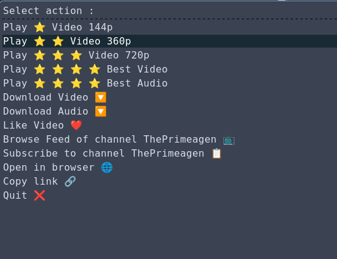
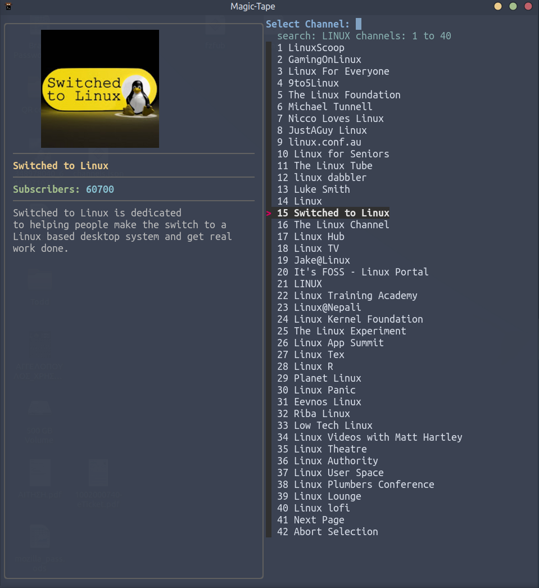

# magic-tape
Magic-tape is an image supporting fuzzy finder command line interface YouTube client.

Downloading data is achieved with [yt-dlp](https://github.com/yt-dlp/yt-dlp) and  [cURL](https://curl.se/), while selections are achieved mainly with [fzf](https://github.com/junegunn/fzf).

Image support is achieved either with [kitty terminal](https://sw.kovidgoyal.net/kitty/),  [ueberzugpp](https://github.com/jstkdng/ueberzugpp), [ueberzug](https://github.com/seebye/ueberzug) or [chafa](https://github.com/hpjansson/chafa).


With magic-tape, through the __main menu__, the user can

  * Browse  videos from __subscriptions__.

  * Browse videos suggested by __YT algorithm__.

  * Browse through __trending__ video feed.

  * make a video __search__, using keywords or phrases.

  * Watch a previously watched video (__watch history__).

  * Browse videos from a __subcsribed channel__.

  * Watch a __liked__ video.

  * Repeat the __previous__ selection.

  * Repeat a previous search (__search history__).

  * __Watch/download__ video/audio content, in various formats.


Through the __miscellaneous menu__ the user can

  * __Edit Preferences file__ (configuration).

  * __Like__ / __Unlike__ a video.

  * __Synchronize__ the above actions with their YouTube account.

  * __Import subscriptions__ from YouTube.

  * __Subscribe__ to/ __Unsubscribe__ from a channel.

  * __Clear__ their watch/search __history__, __liked__ videos, thumbnail __cache__.

---

## Dependencies

Instructions on installing yt-dlp can be found here:

[https://github.com/yt-dlp/yt-dlp#installation](https://github.com/yt-dlp/yt-dlp#installation)

Easily install yt-dlp using pip:

```
pip install yt-dlp
```

Other dependencies include:

* [cURL](https://curl.se/)

* [rofi](https://github.com/davatorium/rofi)

* [fzf](https://github.com/junegunn/fzf)

* [mpv](https://github.com/mpv-player/mpv)

* [jq](https://stedolan.github.io/jq/)

* [xclip](https://github.com/astrand/xclip)

* [dmenu](http://tools.suckless.org/dmenu/)

Regarding image support, it can either be achived with

* [kitty terminal](https://sw.kovidgoyal.net/kitty/)


```
sudo apt install kitty
```

with

* [ueberzugpp](https://github.com/jstkdng/ueberzugpp) (install instructions in the page)

    Ueberzugpp works great with older hardware, where installing kitty is not an option.

with

* [chafa](https://github.com/hpjansson/chafa)


```
sudo apt install chafa
```

or with

* [ueberzug](https://github.com/seebye/ueberzug)

---

---
### How to install Ueberzug

 The [ueberzug](https://github.com/seebye/ueberzug) project has been archived. However, in order to install `ueberzug` one can follow these steps:

- Install dependencies

```
sudo apt install libx11-dev libxres-dev libxext-dev
```
If during the installation process, errors appear due to absence of other depedencies, the user is encouraged to search the error message in the internet in order to locate the misssing dependency. 

- Follow the install instructions found in [this ueberzug fork](https://github.com/gokberkgunes/ueberzug-tabbed):

```
git clone "https://github.com/gokberkgunes/ueberzug-tabbed.git"

cd ueberzug-tabbed

python -m pip install .

```

**NOTE**: One may need to call above `pip install` commands as `pip install --break-system-packages` to successfully install the packages.

---

---

To install these `magic-tape.sh `dependencies, run the following command:

```
sudo apt install curl fzf mpv jq xclip
```

To install `rofi`:

```
sudo apt install rofi
```

To install `dmenu`:

```
sudo apt install dmenu
```

---

## Install

Clone the `magic-tape` repo, and then get to the `magic-tape/` directory:

```
git clone https://gitlab.com/christosangel/magic-tape.git
```
```
cd magic-tape/
```
Make `install.sh` executable, then run it:

```
chmod +x install.sh
```
```
./install.sh
```

### Run

From any directory, run:

```
magic-tape.sh
```

---

---
## Usage

### Configuring

Through the `P Option` in the `Miscellaneous Menu`,  the user can configure many pamaters of this script. The same can be equally well achieved by editing the `~/.config/magic-tape/magic-tape.conf`file, outside the script  :

|Parameter|Explanation|Default Value|Acceptable Values
|---|---|---|---|
| PREF_SELECTOR| Preferred selector is the program used to select actions |rofi | dmenu rofi fzf|
|PREF_EDITOR |Editor used to edit the configuration file|nano -ml|nano, vim, gedit, xed, or any other terminal or graphical text editor|
|PREF_BROWSER|Preferred browser is the browser the cookies of which are used to login to YouTube |firefox|brave-browser-stable, chrome, chromium, edge, firefox, opera, vivaldi|
|LINK_BROWSER|The browser to use to open links with|firefox|Any Browser|
|LIST_LENGTH|The length of the list of videos to choose from|40|10 - 60 or more (although, the smaller the length, the faster the response)
|TERMINAL_MESSAGE_DURATION|Terminal message duration (sleep command)|2|1 - 5 sec (or more, if you love sleeping)
|COLORED_MESSAGES|Tui messages in color|yes|yes / no|
| NOTIFICATION_DURATION| Notification duration|6000|1 - 10000 msec|
| IMAGE_SUPPORT|Image support, the program used to render image previews in the terminal window.| ueberzug|  kitty  ueberzugpp  ueberzug  chafa  none
|SHOW_MPV_KEYBINDINGS| Show mpv keybindings while playing |yes| yes / no|
|DOWNLOAD_DIRECTORY|Directory to download audio video into| /Downloads| `$HOME` is the root directory, e.g. if you want to download your files in the Desktop directory, instead of `$HOME/Desktop`, just put `/Desktop`

Also, by editing the `~/.config/magic-tape/magic-tape.conf` file, the user can configure the colors used in the terminal user text.

Finally, by editing the ~/.config/magic-tape/magic-tape.conf file,  the format of the preferred selector program can be also configured. However the user is advised to **avoid such editing, unless they know what they are doing**.

{height=300}

---


### Import Subscribed channels

When the script is run for the first time, it would be advisable for the user to __import their subcsribed channels from YouTube__.

The user user can do that by navigating to the Miscellaneous Menu _(option m)_, then selecting __Import Subscriptions from YouTube__ _(option I)_.

---

### Main Menu
Once the program is run, the user is presented with the __Main Menu:__

{height=320}

Entering the respective key, the user can :

|key| Action|
|--|--|
|f|Browse their Subscriptions __Feed__.|
|y|Browse __YT__ algorithm Feed|
|t|Browse YouTube __Trending__ Feed.
|s|__Search__ for a key word/phrase|
|r|__Repeat__ previous selection.|
|c|Select a Subscribed __Channel Feed__.|
|l|Browse __Liked__ Videos.|
|h|Browse __Watch History__.|
|j|Browse __Search History__.|
|m|Open __Miscellaneous Menu__.|
|q|__Quit__ the program.|

* In order for the `f and  y Options` to function, the user must already be logged in to YT in the browser.

* Selecting __channel feed__, Browsing __watch history, search history & liked videos__ is done with `rofi`, `fzf` or `dmenu`:

{width=320}
{width=320}
{width=320}
{width=320}

---

### Search and Search History

The user can search for a video using a keyword or phrase. Also the user can browse  __Search history__ and repeat a previous search.

 There is now a **duration filter prompt** in the **search** and **search history** option:

{width=320} 

---

### Video selection

Video selection is done with __fzf__:

{height=450}

### Search shortcuts

|Shortcut|Function|
|---|---|
|Enter, Right Arrow|Accept|
|Esc|Abort Selection|
|Shift+Right Arrow|Next Page|
|Shift+Left Arrow|Previous Page|

Once a video is selected, the user is prompted to __select action__:

* Play ⭐ Video 144p

* Play ⭐⭐ Video 360p

* Play ⭐⭐⭐ Video 720p

* Play ⭐⭐⭐⭐ Best Video

* Play ⭐⭐⭐⭐ Best Audio

* Download Video 🔽

* Download Audio 🔽

* Like Video ❤️

* Browse Feed of channel that uploaded the video  📺

* Subscribe to the channel that uploaded the video 📋

* Open in browser 🌐


* Copy link 🔗


* Quit ❌

{height=180}
{height=180}
{height=180}

---

### Miscellaneous Menu

The __m option__ of the Main Menu opens up the __Miscellaneous Menu__:

{height=320}

Entering the respective key, the user can :

|key| Action|
|--|--|
|P|__Set Up__ Preferences|
|l|__LIKE__ a video.|
|L|__UNLIKE__ a video.|
|I|__Import subscriptions__ from YouTube.|
|n|__Subscribe__ to a new channel.|
|u|__Unsubscribe__ to a new channel.|
|H|Clear __watch history__.|
|S|Clear __search  history__.|
|T|Clear __thumbnail cache.__|
|q|__Quit__ this menu, __Return__ to Main Menu.

---

### Subscribing to a new channel

Selecting the __n option__ of the Miscellaneous Menu, the user can subscribe to a new channel.

Initially, the user is asked to enter a keyword / keyphrase to search channels with.

Channel selection then is made with __fzf__:

{height=320}

* In the __n & u options__ of the Miscellaneous Menu (subcribe/unsubscribe to a channel), after a selection, the user will be asked to sync the changes manually to their YouTube account.


---
