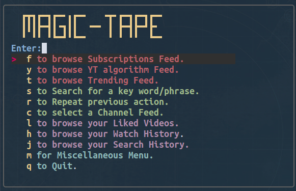
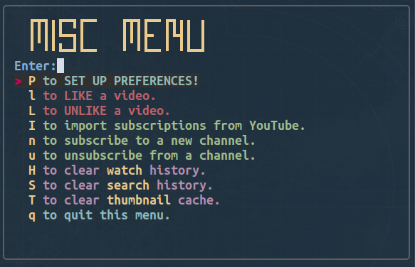

# magic-tape
Magic-tape is an image supporting fuzzy finder command line interface YouTube client.

Image support is achieved either with kitty terminal, ueberzug or chafa.

With magic-tape, through the __main menu__, the user can
  * Browse  videos from __subscriptions__.
  * Browse through __trending__ video feed.
  * make a video __search__, using keywords or phrases.
  * Watch a previously watched video (__watch history__).
  * Browse videos from a __subcsribed channel__.
  * Watch a __liked__ video.
  * Repeat the __previous__ selection.
  * Repeat a previous search (__search history__).
  * __Watch/download__ video/audio content, in various formats.

Through the __miscellaneous menu__ the user can

  * __Set up Preferences__ (configuration).
  * __Like__ / __Unlike__ a video.
  * __Synchronize__ the above actions with their YouTube account.
  * __Import subscriptions__ from YouTube.
  * __Subscribe__ to/ __Unsubscribe__ from a channel.
  * __Clear__ their watch/search __history__, __liked__ videos, thumbnail __cache__.

## Dependencies

Instructions on installing yt-dlp can be found here:

[https://github.com/yt-dlp/yt-dlp#installation](https://github.com/yt-dlp/yt-dlp#installation)

Easily install yt-dlp using pip:

    $ pip install yt-dlp

Other dependencies include:
* [cURL](https://curl.se/)
* [rofi](https://github.com/davatorium/rofi)
* [fzf](https://github.com/junegunn/fzf)
* [mpv](https://github.com/mpv-player/mpv)
* [jq](https://stedolan.github.io/jq/)

Regarding image support, it can either be achived with

* [kitty terminal](https://sw.kovidgoyal.net/kitty/)

    $ sudo apt install kitty

with

* [ueberzug](https://github.com/seebye/ueberzug)

or with

* [chafa](https://github.com/hpjansson/chafa)

    $ sudo apt install chafa

To install these dependencies, run the following command:

     $ sudo apt install curl fzf rofi mpv jq

## Install

    $ mkdir git&&cd git

    $ git clone https://gitlab.com/christosangel/magic-tape.git

To run the script, first you need to make it executable:

    $ cd magic-tape
    $ chmod +x magic-tape.sh
	$ mkdir -p jpg/ json/ search/video/ search/channels/ subscriptions/ history/

Then, run with kitty:

    $ kitty -T magic-tape ./magic-tape.sh

or any other terminal emulator:

    $ ~/git/magic-tape/magic-tape.sh

## Usage

### Set up

While using the script for the first time, the user will be asked for his preferences:
* __Prefered web browser__, the cookies of which will be used by magic-tape in order to extract data from YouTube.
Supported browsers by yt-dlp are brave, chrome, chromium, edge, firefox, opera, vivaldi.
* __Prefered video list length__ to get in each request. Longer video lists may be more preferable, but take longer to get.
* __Dialog message delay time__: the time a message in the cli window remains visible, in seconds.
* __Notification message delay time__: the time a notification remains visible, in seconds.
* __Image Support__:either __kitty__, __ueberzug__ or __none__.
*Toggle __multi-color__ terminal messages.

The user can always alter these preferences using the __P option__ of the __Miscellaneous Menu__.

### Import Subscribed channels

When the script is run for the first time, it would be advisable for the user to __import their subcsribed channels from YouTube__.

The user user can do that by navigating to the Miscellaneous Menu _(option m)_, then selecting __Import Subscriptions from YouTube__ _(option I)_.

### Main Menu
Once the program is run, the user is presented with the __Main Menu:__

Entering the respective key, the user can :

|key| Action|
|--|--|
|f|Browse their Subscriptions __Feed__.|
|t|Browse YouTube __Trending__ Feed.
|s|__Search__ for a key word/phrase|
|r|__Repeat__ previous selection.|
|c|Select a Subscribed __Channel Feed__.|
|l|Browse __Liked__ Videos.|
|h|Browse __Watch History__.|
|j|Browse __Search History__.|
|m|Open __Miscellaneous Menu__.|
|q|__Quit__ the program.|

* In order for the __f & t__ option to function, the user must already be logged in to their browser.

* Selecting __channel feed__, Browsing __watch history, search history & liked videos__ is done with __rofi__:

### Video selection

Video selection is done with __fzf__:

### Search shortcuts

|Shortcut|Function|
|---|---|
|Enter, Right Arrow|Accept|
|Esc|Abort Selection|
|Shift+Right Arrow|Next Page|
|Shift+Left Arrow|Previous Page|

Once a video is selected, the user is prompted to __select action__:
* Play ⭐Video 360p
* Play ⭐⭐Video 720p
* Play ⭐⭐⭐Best Video/Live
* Play ⭐⭐⭐Best Audio
* Download Video 🔽
* Like Video ❤️
* Browse Feed of channel that uploaded the video  📺
* Quit ❌

Audio & Video files will be downloaded at  `~/Desktop/`

### Miscellaneous Menu
The __m option__ of the Main Menu opens up the __Miscellaneous Menu__:

Entering the respective key, the user can :

|key| Action|
|--|--|
|P|__Set Up__ Preferences|
|l|__LIKE__ a video.|
|L|__UNLIKE__ a video.|
|I|__Import subscriptions__ from YouTube.|
|n|__Subscribe__ to a new channel.|
|u|__Unsubscribe__ to a new channel.|
|H|Clear __watch history__.|
|S|Clear __search  history__.|
|T|Clear __thumbnail cache.__|
|q|__Quit__ this menu, __Return__ to Main Menu.

### Subscribing to a new channel

Selecting the __n option__ of the Miscellaneous Menu, the user can subscribe to a new channel.

Initially, the user is asked to enter a keyword / keyphrase to search channels with.

Channel selection then is made with __fzf__:

* In the __n & u options__ of the Miscellaneous Menu (subcribe/unsubscribe to a channel), after a selection, the user will be asked to sync the changes manually to their YouTube account.

* __Liking/Unliking a video and unsubscribing from a channel options__ are done with __rofi__:

